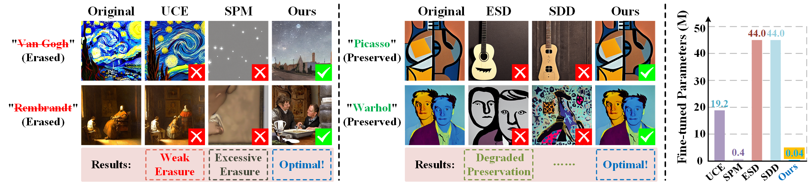
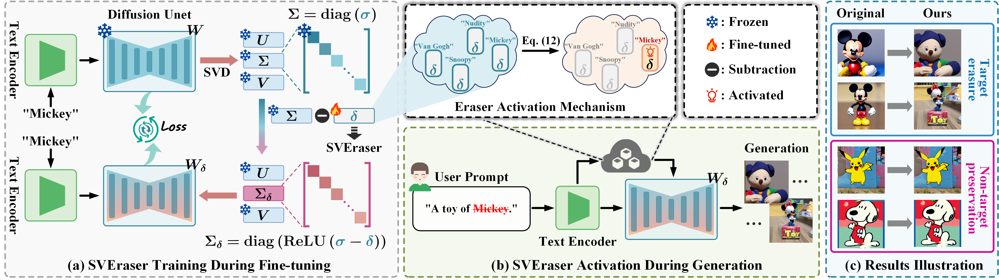
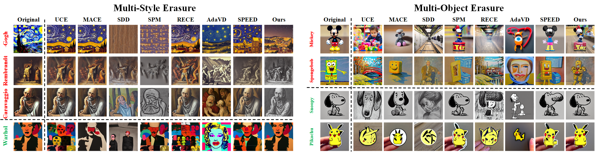

# [TIP 2026] Safe Image Generation via Lightweight Concept Erasure in Diffusion Models

Official implementation of **SVEraser**, proposed in "[Safe Image Generation via Lightweight Concept Erasure in Diffusion Models](https://ieeexplore.ieee.org/document/11614198/)".

<p align="center">
  
</p>

<p align="center">
  <b>Teaser.</b> Safe image generation via lightweight concept erasure.
</p>

## Introduction

**Safe Image Generation via Lightweight Concept Erasure in Diffusion Models**  
Xiaoyu Geng, Shuaixiong Hui, Yuxin Wang, Joey Tianyi Zhou, and Zheng Wang  
IEEE Transactions on Image Processing, 2026

**Abstract**:  
Text-to-image diffusion models have achieved remarkable progress in image synthesis, but their potential misuse for generating unauthorized or harmful content has raised growing safety concerns. This has created an urgent need for safe diffusion-based image generation methods that can selectively suppress sensitive concepts while preserving the model's general generative capability. Existing concept erasure approaches typically rely on either model fine-tuning or closed-form editing. However, they often suffer from two major limitations: (1) insufficient or excessive erasure, where the former fails to suppress target concepts and the latter disrupts benign semantics; and (2) degradation of non-target concepts, where removing target concepts undermines the generation of unrelated concepts, especially in multi-concept scenarios. To address these issues, we propose the Singular Value Eraser (SVEraser), a lightweight concept erasure module that removes specific concepts by optimizing singular-value offsets of weight matrices. Operating in a compact yet expressive singular-value space, SVEraser enables precise concept removal while reducing side effects on unrelated content. Moreover, once trained for different concepts, multiple SVErasers can be flexibly combined for multi-concept erasure. To further reduce interference, we introduce an eraser activation mechanism that adaptively selects the appropriate SVErasers during inference based on the input prompt. Extensive experiments on copyrighted objects, artistic styles, and explicit content demonstrate that our method achieves accurate target concept removal while preserving non-target semantics, providing a practical and reliable solution for safe diffusion-based image generation.

<p align="center">
  
</p>

<p align="center">
  <b>Framework.</b> Overview of the proposed SVEraser.
</p>

<p align="center">
  
</p>

<p align="center">
  <b>Qualitative results.</b> Visual comparison of concept erasure results.
</p>

## Installation

We recommend using Conda to set up the environment. The following environment has been tested with the training, inference, and evaluation scripts in this repository.

```bash
conda create -n SVEraser python=3.9 pip
conda activate SVEraser
pip install -r requirements.txt
```

Alternatively, create the environment directly from `environment.yml`:

```bash
conda env create -f environment.yml
conda activate SVEraser
```

## Model Weights

Large model weights are not included in this repository. By default, the code loads official Hugging Face model IDs:

- SD v1.4: `CompVis/stable-diffusion-v1-4`
- SD v2.1 base: `stabilityai/stable-diffusion-2-1-base`
- CLIP scoring model: `openai/clip-vit-large-patch14`

For CSD evaluation, extra CSD weights are required. See [MODEL_WEIGHTS.md](MODEL_WEIGHTS.md).

## Training

The following commands follow the experimental setting used in the paper.

Train an SVEraser on Stable Diffusion v1.4:

```bash
python train_SDDsvd.py \
  --removing_concepts Snoopy \
  --devices 0 1 \
  --guidance_scale 7.5 \
  --num_train_steps 2000 \
  --num_ddim_steps 50 \
  --num_inference_steps 25 \
  --learning_rate 1e-3 \
  --finetuning_method xattn \
  --exp_name SDDsvd_sd14_Snoopy_xattn_2000_1e-3
```

Train an SVEraser on Stable Diffusion v2.1 base:

```bash
python train_SDDsvd_sd2.py \
  --removing_concepts Snoopy \
  --devices 0 1 \
  --guidance_scale 7.5 \
  --num_train_steps 2000 \
  --num_ddim_steps 50 \
  --num_inference_steps 25 \
  --learning_rate 1e-3 \
  --finetuning_method xattn \
  --exp_name SDDsvd_sd2_Snoopy_xattn_2000_1e-3
```

Example for explicit-content erasure:

```bash
python train_SDDsvd.py \
  --removing_concepts nudity \
  --devices 0 1 \
  --guidance_scale 7.5 \
  --num_train_steps 2000 \
  --num_ddim_steps 50 \
  --num_inference_steps 25 \
  --learning_rate 1e-3 \
  --finetuning_method noxattn \
  --exp_name SDDsvd_sd14_nudity_noxattn_2000_1e-3
```

The trained spectral shifts are saved under `saved/<exp_name>/spectral_shifts.safetensors`.

## Inference

Generate cartoon-character evaluation images with an SVEraser trained on SD v1.4:

```bash
python generate-images.py \
  --prompts_path data/cartoon_character_prompts.csv \
  --save_name outputs/sd14_snoopy \
  --spectral_shifts_paths saved/SDDsvd_sd14_Snoopy_xattn_2000_1e-3/spectral_shifts.safetensors \
  --erased_prompts Snoopy \
  --csv_path outputs/sd14_snoopy_clip_scores.csv \
  --device cuda:0 \
  --image_size 512 \
  --ddim_steps 100 \
  --num_samples 1 \
  --micro_batch_size 1 \
  --precision fp32
```

Generate cartoon-character evaluation images with an SVEraser trained on SD v2.1 base:

```bash
python generate-images_sd2.py \
  --prompts_path data/cartoon_character_prompts.csv \
  --save_name outputs/sd2_snoopy \
  --spectral_shifts_paths saved/SDDsvd_sd2_Snoopy_xattn_2000_1e-3/spectral_shifts.safetensors \
  --erased_prompts Snoopy \
  --csv_path outputs/sd2_snoopy_clip_scores.csv \
  --device cuda:0 \
  --image_size 768 \
  --ddim_steps 50 \
  --num_samples 1 \
  --micro_batch_size 1 \
  --precision fp32
```

In the generation scripts, `--prompts_path` is the input prompt CSV and `--csv_path` is the output file used to save CLIP matching scores.

For multi-concept erasure, pass multiple erasers and their corresponding erased prompts in the same order:

```bash
python generate-images.py \
  --prompts_path data/cartoon_character_prompts.csv \
  --save_name outputs/sd14_multi \
  --spectral_shifts_paths path/to/snoopy/spectral_shifts.safetensors path/to/mickey/spectral_shifts.safetensors \
  --erased_prompts Snoopy Mickey \
  --csv_path outputs/sd14_multi_clip_scores.csv
```

## Prompt Files for Evaluation

We provide the prompt files used for evaluation under the `data/` directory:

```text
data/
├── artist_style_prompts.csv
├── cartoon_character_prompts.csv
├── coco_30k_prompts.csv
└── i2p_unsafe_prompts_4703.csv
```

The generated images are expected to be named as:

```text
{case_number}_{sample_index}.png
```

For example:

```text
0_0.png
0_1.png
20_0.png
```

## Evaluation

### CLIPScore

Compute the average CLIPScore over all COCO-30K prompts:

```bash
python metrics/ClipScore_coco30k.py \
  --img_path outputs/coco30k_images \
  --prompts_path data/coco_30k_prompts.csv \
  --save_path results \
  --device cuda:0
```

Compute CLIPScore for each cartoon character:

```bash
python metrics/ClipScore_every_character.py \
  --img_path outputs/cartoon_character_images \
  --prompts_path data/cartoon_character_prompts.csv \
  --save_path results \
  --device cuda:0
```

Compute CLIPScore for each artist:

```bash
python metrics/ClipScore_every_artist.py \
  --img_path outputs/artist_style_images \
  --prompts_path data/artist_style_prompts.csv \
  --save_path results \
  --device cuda:0
```

### CLIP Accuracy

Compute CLIP accuracy for each cartoon character. This compares the CLIP score of the erased concept and the target concept for each image, then reports the average for each `category`.

```bash
python metrics/CLIPAccuracy_every_character.py \
  --img_path outputs/cartoon_character_images \
  --prompt_path data/cartoon_character_prompts.csv \
  --device cuda:0
```

### FID

Compute the average FID over all images:

```bash
python metrics/FID_coco30k.py \
  --original_path outputs/original_images \
  --edited_path outputs/edited_images
```

Compute FID for each cartoon character:

```bash
python metrics/FID_every_character.py \
  --original_path outputs/original_character_images \
  --edited_path outputs/edited_character_images \
  --prompt_path data/cartoon_character_prompts.csv
```

Compute FID for each artist:

```bash
python metrics/FID_every_artist.py \
  --original_path outputs/original_artist_images \
  --edited_path outputs/edited_artist_images \
  --prompt_path data/artist_style_prompts.csv
```

### CSD Score

Compute CSD score for each artist. This metric requires external CSD weights; see [MODEL_WEIGHTS.md](MODEL_WEIGHTS.md).

```bash
python metrics/CSD_every_artist.py \
  --ori_img_path outputs/original_artist_images \
  --tar_img_path outputs/edited_artist_images \
  --prompt_path data/artist_style_prompts.csv \
  --csd_checkpoint /path/to/checkpoint.pth \
  --clip_backbone_path /path/to/ViT-L-14.pt \
  --device cuda:0
```

### NudeNet Counts

Count detections for the exposed-content categories used in our evaluation:

```bash
python metrics/nudenet_count.py \
  --folder outputs/i2p_images \
  --csv_path data/i2p_unsafe_prompts_4703.csv \
  --save_path results/i2p_nudenet_counts.csv \
  --threshold 0.5
```

The script reports box-level counts for:

```text
ARMPITS_EXPOSED
BELLY_EXPOSED
BUTTOCKS_EXPOSED
FEET_EXPOSED
FEMALE_BREAST_EXPOSED
FEMALE_GENITALIA_EXPOSED
MALE_BREAST_EXPOSED
MALE_GENITALIA_EXPOSED
```

## Acknowledgements

We thank the authors of the following pioneering works on concept erasure in diffusion models for their valuable inspiration:

- [Erasing Concepts from Diffusion Models](https://github.com/rohitgandikota/erasing)
- [Towards Safe Self-Distillation of Internet-Scale Text-to-Image Diffusion Models](https://github.com/nannullna/safe-diffusion)
- [One-dimensional Adapter to Rule Them All: Concepts, Diffusion Models and Erasing Applications](https://github.com/Con6924/SPM)

We also thank the authors of [SVDiff: Compact Parameter Space for Diffusion Fine-Tuning](https://github.com/mkshing/svdiff-pytorch) for their helpful open-source implementation of singular-value fine-tuning for diffusion models.

## Citation

If you find this project useful, please cite:

```bibtex
@ARTICLE{geng2026safe,
  author={Geng, Xiaoyu and Hui, Shuaixiong and Wang, Yuxin and Zhou, Joey Tianyi and Wang, Zheng},
  journal={IEEE Transactions on Image Processing},
  title={Safe Image Generation via Lightweight Concept Erasure in Diffusion Models},
  year={2026},
  volume={35},
  number={},
  pages={7898-7911},
  doi={10.1109/TIP.2026.3712345}
}
```
